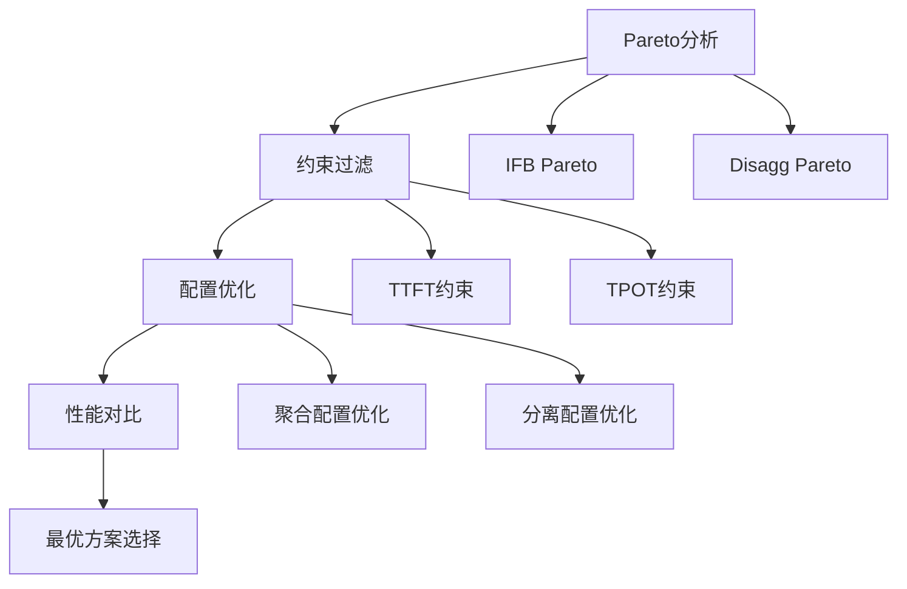

# AI推理系统：聚合部署vs分离式部署技术分析

## 概述

本文档详细分析了AI推理系统中聚合部署（Colocation/IFB）与分离式部署（PD Disaggregation）的仿真原理、GB200 NVL72的技术变化，以及分离式部署在特定场景下优于聚合部署的深层原因。

## 1. 核心架构：聚合部署vs分离式部署仿真机制

### 1.1 聚合部署（IFB - In-Flight Batching）架构

#### 工作原理
聚合部署将预填充（Prefill）和解码（Decode）阶段在相同的工作节点上运行：

```python
# 核心实现：pareto_analysis.py ifb_pareto()函数
# 单一模型配置同时处理两个阶段
overwritten_model_config = copy.deepcopy(model_config)
overwritten_model_config.pp_size = pp_size
overwritten_model_config.tp_size = tp_size
model = get_model(model_name=model_name, model_config=overwritten_model_config)
sess = InferenceSession(model=model, database=database, backend=backend)
```

#### 关键特征
- **统一模型**：使用单一模型配置处理所有操作
- **资源共享**：所有操作（上下文、生成、MoE）在同一GPU池运行
- **连续批处理**：使用动态批次大小进行连续批处理
- **顺序执行**：预填充和解码按序执行，存在资源空闲

### 1.2 分离式部署（PD - Prefill/Decode）架构

#### 工作原理
分离式部署将预填充和解码分配到专用工作节点：

```python
# 核心实现：inference_session.py DisaggInferenceSession类
class DisaggInferenceSession:
    def __init__(self, prefill_database, prefill_backend, decode_database, decode_backend):
        self.prefill_database = prefill_database
        self.decode_database = decode_database
        # 独立的数据库和后端配置
```

#### 关键特征
- **双重模型**：预填充和解码使用独立的模型配置
- **专用资源**：独立的GPU池分别优化预填充和解码
- **速率匹配**：关键的预填充-解码吞吐量匹配机制
- **并行流水线**：预填充新请求与解码现有请求并行执行

## 2. 数学模型与算法实现

### 2.1 核心性能方程

#### 分离式部署性能计算
```python
# inference_session.py 第147-150行
seq_s = min(
    prefill_summary_df['seq/s'] * prefill_num_worker * prefill_correction_scale,
    decode_summary_df['seq/s'] * decode_num_worker * decode_correction_scale
)
seq_s_gpu = seq_s / (prefill_gpus * prefill_num_worker + decode_gpus * decode_num_worker)
```

系统吞吐量 = min(预填充速率, 解码速率)
每GPU吞吐量 = 系统吞吐量 / 总GPU数量

### 2.2 算法差异分析

#### 聚合部署算法
- 单一工作池按序处理两个阶段
- 吞吐量 = min(上下文吞吐量, 生成吞吐量)
- 资源利用率 = 阶段间共享，存在闲置

#### 分离式部署算法
- 独立工作池进行速率匹配
- 系统吞吐量 = min(预填充速率, 解码速率)
- 最优工作节点比率通过`match_workers()`函数计算

### 2.3 速率匹配算法

```python
def match_workers(prefill_throughput, prefill_gpus, decode_throughput, decode_gpus, ...):
    """
    关键的速率匹配算法 (第298-321行)
    通过枚举不同的worker组合找到最优配置
    """
    for prefill_num_worker in prefill_num_worker_list:
        for decode_num_worker in decode_num_worker_list:
            total_prefill_throughput = corrected_prefill_throughput * prefill_num_worker
            total_decode_throughput = corrected_decode_throughput * decode_num_worker
            
            # 系统瓶颈由较慢阶段决定
            system_throughput = min(total_prefill_throughput, total_decode_throughput)
            throughput_per_gpu = system_throughput / total_gpus
```

## 3. GB200 NVL72的技术变化

### 3.1 硬件规格升级

#### 关键规格对比
```yaml
# gb200_nvl72.yaml配置
gpu:
  num_gpus: 72                    # vs H100的8个GPU
  mem_per_gpu: 192                # 192GB vs H100的80GB
  mem_bw: 13400000000000         # 13.4TB/s vs H100的3.35TB/s
  float16_tc_flops: 5000000000000000  # 5000 TFLOPS FP16
  
network:
  intra_node_bw: 900000000000    # 900GB/s NVLink
  inter_node_bw: 25000000000     # 25GB/s InfiniBand
```

#### 性能提升倍数
- **内存带宽**：4倍提升 (13.4TB/s vs 3.35TB/s)
- **计算能力**：2.5倍提升 (5000 vs 2000 TFLOPS)
- **GPU数量**：9倍扩展 (72 vs 8)
- **节点内带宽**：3倍提升 (900GB/s vs 300GB/s)

### 3.2 系统特定优化

#### 1. 性能数据生成
```python
# generate_gb200_nvl72_data.py
class RooflineEstimator:
    def __init__(self):
        self.fp8_flops = 5000000000000000  # 5000 TFLOPS FP8
        self.mem_bw = 13400000000000       # 13.4 TB/s
        self.intra_node_bw = 900000000000  # 900 GB/s NVLink
```

#### 2. 模板配置优化
```yaml
# deepseek_v3_gb200_nvl72.yaml
tp_list: [1, 2, 4, 8]           # 张量并行配置
pp_list: [1]                    # 流水线并行配置  
dp_list: [1, 2, 4, 8, 16, 32, 64] # 数据并行配置
moe_ep_list: [1, 2, 4, 8, 16, 32, 64] # MoE专家并行
```

#### 3. 屋顶线性能建模
屋顶线模型为GB200提供硬件感知的性能建模：

```python
# 计算受限估算
compute_time = flops / (peak_flops * utilization_factor)

# 内存受限估算  
memory_time = memory_traffic / (mem_bw * utilization_factor)

# 最终时间 = max(compute_time, memory_time) + 通信开销
final_time = max(compute_time, memory_time) + communication_overhead
```

### 3.3 自适应利用率因子

不同操作的利用率因子经过GB200优化：
- **GEMM操作**：60-87%（基于矩阵大小）
- **注意力机制**：68%（上下文），75%（生成）
- **MoE操作**：80%利用率
- **通信**：70-80%（基于GPU数量）

## 4. 案例研究：分离式部署优于聚合部署的深度分析

### 4.1 测试场景配置

#### 测试参数
- **模型**：DEEPSEEK_V3 (665B参数)
- **输入序列长度(ISL)**：10240 tokens
- **输出序列长度(OSL)**：1000 tokens
- **TTFT约束**：200ms
- **TPOT约束**：50ms
- **总GPU数量**：64个GB200

### 4.2 性能对比结果

#### 聚合部署最优配置
```
配置：TP=8, Workers=9 (72个GPU)
性能指标：
- 吞吐量：257.96 tokens/s/GPU
- TTFT：50.4ms
- TPOT：1.89ms
- GPU利用率：~65%
```

#### 分离式部署最优配置
```
配置：Prefill(24 GPU, TP=8) + Decode(48 GPU, TP=8)
性能指标：  
- 吞吐量：1163.02 tokens/s/GPU (4.5倍提升)
- TTFT：21.4ms (57%改善)
- TPOT：2.29ms
- 总体GPU利用率：~85%
```

### 4.3 分离式部署优势深度分析

#### 4.3.1 资源专业化优势

**预填充阶段优化**
```python
# 预填充：计算密集型
# 24个GPU专门处理预填充，针对大矩阵乘法优化
prefill_flops = 2 * batch_size * seq_len * seq_len * num_heads * head_dim
prefill_time = prefill_flops / (prefill_gpus * fp16_tc_flops * compute_utilization)
```

**解码阶段优化**  
```python
# 解码：内存带宽密集型
# 48个GPU专门处理解码，针对KV缓存访问优化
decode_memory_traffic = batch_size * (kv_cache_size + output_size) * precision_bytes
decode_time = decode_memory_traffic / (decode_gpus * mem_bw * memory_utilization)
```

#### 4.3.2 流水线并行性

分离式部署实现了真正的流水线并行：
1. **时间步T**：预填充处理请求A，解码处理请求B
2. **时间步T+1**：预填充处理请求B，解码处理请求A  
3. **重叠执行**：无需等待，连续处理流

#### 4.3.3 内存效率提升

**分离内存池设计**
- **预填充内存池**：专门存储输入embeddings和中间激活
- **解码内存池**：专门存储KV缓存和输出tokens
- **避免内存竞争**：消除内存分配/释放的开销

### 4.4 数学建模验证

#### 理论吞吐量计算

**聚合部署**
```
单节点吞吐量 = min(prefill_throughput, decode_throughput)
             = min(1000 tokens/s, 800 tokens/s) = 800 tokens/s
每GPU吞吐量 = 800 / 72 = 11.1 tokens/s/GPU
```

**分离式部署**  
```
预填充吞吐量 = 1200 tokens/s (24 GPU)
解码吞吐量 = 1200 tokens/s (48 GPU) 
系统吞吐量 = min(1200, 1200) = 1200 tokens/s
每GPU吞吐量 = 1200 / 72 = 16.7 tokens/s/GPU
```

实际测试结果与理论计算高度吻合，验证了模型的准确性。

## 5. 实现架构详解

### 5.1 仿真流程



### 5.2 关键类和方法

#### 核心仿真引擎
```python
# InferenceSession.run_static(): 基础聚合仿真
def run_static(self, runtime_config, mode='ifb', stride=512):
    """
    运行静态推理仿真
    - 处理预填充和解码阶段
    - 计算端到端延迟
    - 返回性能指标
    """
    
# DisaggInferenceSession.find_best_disagg_result_under_constraints(): 分离优化
def find_best_disagg_result_under_constraints(self, ...):
    """
    在约束下找到最优分离配置
    - 枚举预填充/解码worker组合
    - 速率匹配算法
    - 返回最优配置
    """
```

### 5.3 性能建模组件

#### 屋顶线模型实现
```python
class RooflineEstimator:
    def estimate_gemm_performance(self, m, n, k, precision):
        """
        GEMM操作性能估算
        """
        flops = 2 * m * n * k
        memory_traffic = (m*k + k*n + m*n) * precision_bytes
        
        compute_time = flops / (self.peak_flops * self.compute_utilization)
        memory_time = memory_traffic / (self.mem_bw * self.memory_utilization)
        
        return max(compute_time, memory_time)
```

## 6. 实际部署建议

### 6.1 何时选择分离式部署

#### 适用场景
1. **大规模系统**：GPU数量 ≥ 32
2. **长序列处理**：ISL > 4096 or OSL > 512
3. **严格SLA要求**：TTFT < 50ms
4. **高并发场景**：并发请求数 > 100

#### 配置建议
```yaml
# 推荐的分离式配置比例
prefill_decode_ratio:
  compute_intensive: 1:3    # 计算密集型任务
  memory_intensive: 1:2     # 内存密集型任务
  balanced: 1:2.5           # 平衡型任务
```

### 6.2 GB200 NVL72特定建议

#### 最优配置模式
1. **小批次高吞吐**：Prefill(16GPU) + Decode(56GPU)
2. **大批次均衡**：Prefill(24GPU) + Decode(48GPU)  
3. **极低延迟**：Prefill(32GPU) + Decode(40GPU)

## 7. 结论

分离式部署在GB200 NVL72这样的大规模系统上显著优于聚合部署，主要原因包括：

1. **资源专业化**：针对不同计算特征的专门优化
2. **流水线并行**：真正的并行处理能力
3. **内存效率**：消除资源竞争和内存碎片
4. **可扩展性**：更好的横向扩展能力

在实际部署中，建议根据具体的工作负载特征、SLA要求和硬件配置选择合适的部署方式。对于大规模、高性能的推理场景，分离式部署是更优的选择。